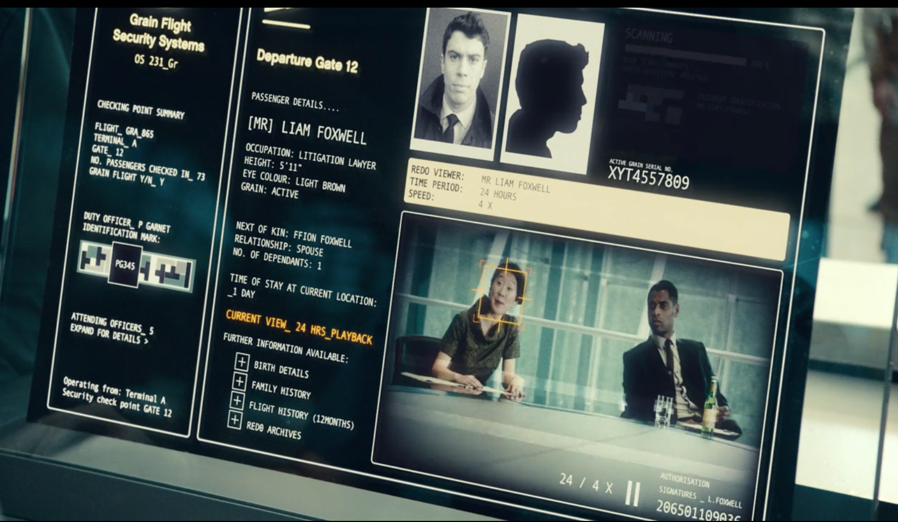

# Surveillance

The Grain technology featured in the episode shows unprecedented capacity for
surveillance, both implied and directly shown. Since the Grain allows users to
store their memories in high quality for an indefinite time, both locally and
online, the government could theoretically use this information for its own
purposes. For example, in the episode the main character goes to an airport
for a flight, and is screened by security. The security officers don't check
his bags or search his body, instead asking for access to his memories --
the past 24 hours, the past week at a faster speed, and possibly the past
month at a still faster speed. For obvious reasons this is a blatant
privacy violation and ultimately a form of surveillance -- one where
anyone wishing to travle long-distance is subject to the analog equivalent
of having security officers retroactively follow them around for a month
or more.

Worse, nothing really stops the government from simply saving these
memories for an indefinite time -- they could use them to conduct
surveillance on massive amounts of people, even those who never travelled
through an airport. A Grain "backup service" is also referenced during the
episode, implying that it's possible to store memories in the cloud (read:
someone else's computer), which the government could theoretically ask for
access to. There has already been a case where the government asked for
access to an Amazon Alexa's voice recordings (which turned out not to
exist, because that's now how Alexa works) as part of a criminal
investigation – even though that request failed, it shows that even our
own government of the present would probably be willing to issue the same
request for Grain records. Again, this kind of surveillance would include
anyone *seen* by a Grain user, so even a fraction of the population with
the Grain could have devastating surveillance implications.

[Home](https://saahilclaypool.github.io/blackmirror/)