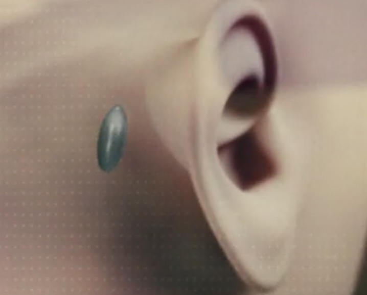

# Technologies

Below is a list of technologies seen in the movie; further below, the technologies are grouped into future,
emerging, and impossible.

## List

* "Grain" memory implant
	* Implant just behind one of the ears the size of a *grain* of rice
	* According to an ad, the grain is capable of recording data from all senses, and replaying it in the brain, or on a display
	* Improper removal can cause brain damage or loss of vision implying some direct connection to the brain
	* "Grain assistant" can read your blood alcohol concentration, tell you if you're too drunk to drive
* Eye HUD effect
	* Allows the user to view information from their grain directly without need for an external display
	* Controlled with a small keychain fob, everyone keeps one in their pockets
	* Can do lip reading, zoom/enhance, memory organization, etc.
	* Causes glassy effect in the eyes when using the HUD effect
	* Unclear if this is enabled by an implant, or the grain's link to the brain
* Readily compatible and connectible devices, gesture controlled
	* Every screen shown can have arbitrary content casted to it
	* Grain users can gesture to a TV with their fob, show re-dos, or interact with their normal HUD
	* Can pay taxi fares (and probably other transactions) using your keychain fob
* Facial recognition & association check 
	* Security terminals can show officers re-dos at various speeds
	* Computer searches for faces in the re-dos
	* Information about association with people shown is given, e.g. "Employer"

## Future Technology

A heads-up display in the eye is definitely a future technology with little progress made in that
area. Note that this is distinct from a heads-up display shown in contact lenses -- the episode suggests that
getting your grain gouged out could result in blindness or brain damage, implying that the grain is probably
connected to the vision center of the brain and therefore would not need contact lenses. Either way, no
evidence of contact lenses is ever shown.

The grain itself doesn't exist, nor is it a technology emerging in the near future, but strictly speaking it's
not impossible. The grain itself is really just a device with incredibly high storage density, enough to
save at least 30-40 years of memories -- based both on the job appraisal scene and Liam & Ffion's review of
their child's grain footage, grains are implanted very early in life. The technology could be either a high
density storage medium, or a better video compression system, or both -- neither of which is impossible. With current compression technology, a lifetime of footage would require ~6 EB (6 million TB) of data assuming an estimated 4K resolution at 80x zoom. This would place the data storage density at 2.2 billion times higher than a microSD card.

The connection to the brain/eyes and the eye implants are definitely not present in our time or even
emerging yet, but efforts at connecting brains and computers are progressing and the technology has not
been ruled out as impossible, so we can only categorize this as "future". Existing Brain Computer Interface (BCI) technologies have come a long way, but are still extremely far from what is required for full recording and replaying of memories. BCI technologies such as ECoG, microelectrodes, and microelectrode arrays (MEA) have allowed impressing recognition of patterns in brain activity, but require extremely dangerous invasive surgery and are highly limited in capability [1]. We can currently control prostheses from brain signals, but that is nowhere near capturing an image from the eyes.  

### Emerging Technology

Augmented reality of the sort we see in the episode *is* an emerging technology, with well known efforts
such as the Google Glass or Microsoft HoloLens making strides towards high quality augmentation. While we
don't have nearly the same level augmentation that a grain provides (lip reading, zoom, etc), or even the
user interface (with particular respect to the grain controller) and ease of casting content to devices.

### Impossible

Interestingly, nothing in the episode seemed genuinely impossible, perhaps just a little distant in the future.
We suspect that this was a conscious decision by the writers to show the complications that could arise with only
some advancement of existing technology.

### References

[1] "SMARTPHONE AND TABLET MICROSDHC/XC CLASS 10 UHS-I U1." Integral Memory. Web. "September 30 2018" <https://www.integralmemory.com/product/smartphone-and-tablet-microsdhc-microsdxc-class-10-uhs-i-u1-memory-card>.
[2] Bashir, I. Morshed*, and Khan Abdulhalim. "A Brief Review of Brain Signal Monitoring Technologies for BCI Applications: Challenges and Prospects." Journal of Bioengineering & Biomedical Science.1 (2014): 1-10. Web.

[Home](https://saahilclaypool.github.io/blackmirror/)
