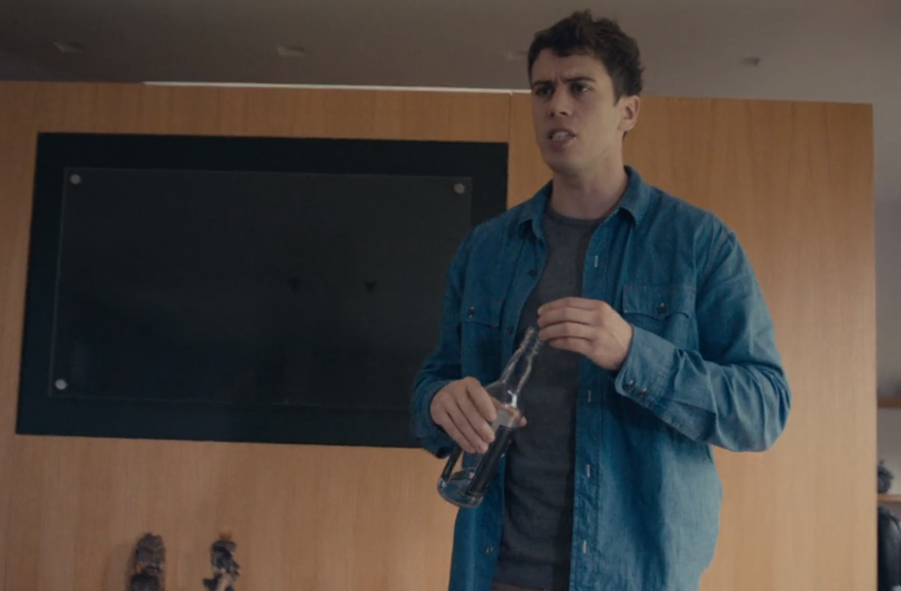

# Movie Timeline

In this episode, nearly everyone has an implant called a grain. The grain records everything you experience, and
provides a small device to scroll through these memories on a heads-up-display shown directly through the eyes.
The show presents a common story -- one person cheating on another -- with the twist of the grain to help and
harm in investigation of this affair.

The events below are shown in chronological order:

## The Appraisal

The main character, Liam Foxwell, is present at a job appraisal meeting with some leaders at his law firm. At
first Liam believes the appraisal went well, but upon reviewing the memories saved in his grain he is dismayed
to find that his reviewers were more likely critical than not (saying "We hope to look forward to seeing you"),
and decides that the appraisal went poorly.

After his appraisal, Liam catches a flight home. Instead of a modern TSA-style security screening, he need only
walk through a glass-like detector and provide a quick "re-do" (playback of memories) to the security agent.
The security agent asks for the last 24 hours, then the last week at 64x playback speed. The software on the
security terminal computer uses facial recognition to highlight key people in his recent past, such as the
people who conducted his appraisal.

## The House Party

Liam arrives at a house party seemingly held by some old friends of his wife, using his grain to quickly review
memories of people he's since forgotten before entering the house. Liam's wife Ffion ("Fi") is seen talking
with another man, Jonas, before Ffion notices him and is surprised.

A small gathering before dinner occurs, where one man shows a re-do of some slightly worn carpet in a 5-star
hotel, complaining that he'll have that memory for the rest of his life (and that he wasted money for it).
After hearing about his recent appraisal, the group asks Liam to show them a re-do so they can "appraise the
appraisal". Liam declines, the group pressures him some, and Jonas briefly defends him, creating some
awkwardness.

At dinner, a new character is brought up who discusses her experience being "gouged" (forced removal of her
grain), her memories likely being offered up to someone rich enough to pay for them (their value is implied to
be in the memories' intimate contents). Everyone at the party agrees that they couldn't go grainless, arguing
that real memories can be twisted or are easily faked; the sole grainless person present uncomfortably says that
she's "just happier".

Jonas reveals that he uses his grain to store and replay past sexual encounters with other women, possibly to
the detriment of other relationships.

## Home for a Night Cup

The episode cuts to a scene of Liam and Ffion in the car discussing the appraisal (Liam shows her the re-do,
they use the zoom feature to debate whether they're making a tick on a paper or something else). Liam has
apparently invited Jonas to come back to his place for a nightcap, but when Ffion brings it up, Liam contests it.
Ffion shows a re-do to one-up him, where Liam does indeed invite Jonas over, but is clearly unenthusiastic
about it.

Liam becomes suspicious of Jonas and uses his grain to show a re-do of the house party, where on one of the
screens *another* redo from long ago was visible, showing Ffion making out with Jonas. Liam and Ffion fight,
since she obfuscated/lied about her past relationship with Jonas, and about how long it was -- the grain
memory proved it was longer than she claimed.

Later, the two have very impassionate makeup sex, both choosing to use their grains to relive past occasions
instead of putting effort into this one.

## Paranoia 

Liam wakes up early and starts analyzing each moment of the house party using his grain, in particular watching
Ffion laughing excessively at a joke that Jonas made. Liam becomes outraged at this memory and believes Ffion
is cheating on him.

## Attacking Jonas

After drinking heavily, Liam drives to Jonas's house (despite the intoxication warnings of his grain) and
physically threatens him, forcing him to delete all grain memories of Ffion (Jonas's overnight guest, the woman
without a grain, calls the police but is turned away when she tells them she doesn't have a grain feed to show
them). Jonas has these memories organized into an album, a "stash" of his times with Ffion. Jonas deletes
the memories.

## Confronting Ffion

After crashing his car on the way back, Liam (now somewhat more sober) reviews the grain memories and zooms
in on a screen showing Jonas's memories of Ffion, one of them labeled as 18 months ago, when he was married --
and importantly, when Liam and Ffion were trying for a baby (which they now have).

Liam confronts his wife with the memories, asking her if she used a condom. She says yes, so Liam asks her to
prove it by showing her the memories. Ffion claims she deleted the memories, so he asks her to show him the
blank spot in her memory "timeline". She tries to covertly delete the memories but is thwarted by Liam, who
watches them. It is implied that the memory reveals that Liam and Ffion's child is in fact Ffion and Jonas's.

## Aftermath 

Liam walks through the now darkened and messy house, reviewing past memories, some of them pleasant, and some
of them revealing Ffion's unfaithful or manipulative behavior (e.g. quietly laughing at Liam after they argue
over whether she was lying). Liam finally goes to the bathroom and uses a razor to remove his grain, and the
episode ends on a cut to black.

[Home](https://saahilclaypool.github.io/blackmirror/)
